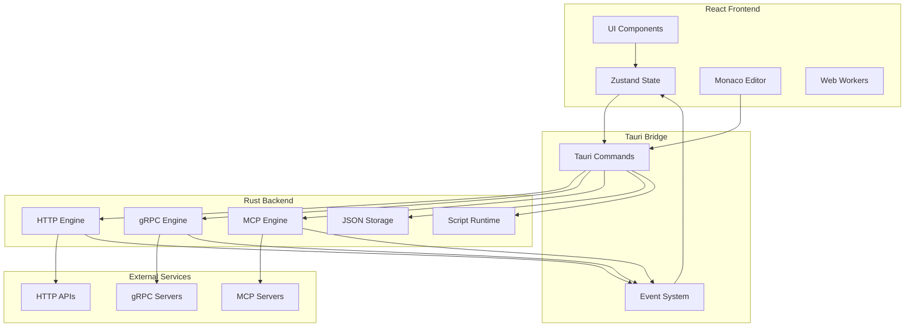

# Openman Architecture Design Document

## Overview

Openman is a cross-platform API testing tool similar to Postman, supporting HTTP, gRPC, and MCP (Model Context Protocol) services. Built with Tauri (Rust backend) and React (frontend) for optimal performance and native feel.

## Technology Stack

### Frontend

- **Framework**: React 18+ with TypeScript
- **State Management**: Zustand (lightweight, performant)
- **UI Components**:
  - shadcn/ui (headless, accessible components)
  - Tailwind CSS for styling
- **Code Editor**: Monaco Editor (same as VS Code)
- **HTTP Client**: Native fetch with Tauri invoke for advanced features
- **Build Tool**: Vite

### Backend (Tauri/Rust)

- **HTTP Client**: reqwest (async, feature-rich)
- **gRPC**: tonic + prost (Rust gRPC stack)
- **MCP**: Custom implementation using tokio streams
- **File System**: std::fs + tauri::api for JSON storage
- **Async Runtime**: tokio

### Data Storage

- **Format**: JSON files (human-readable, git-friendly)
- **Location**: Application data directory
- **Structure**: Workspace-based organization

---

## System Architecture



---

## Project Structure

```
openman/
├── src-tauri/                    # Rust backend
│   ├── src/
│   │   ├── main.rs              # Tauri entry point
│   │   ├── commands/            # Tauri command handlers
│   │   │   ├── mod.rs
│   │   │   ├── http.rs          # HTTP request commands
│   │   │   ├── grpc.rs          # gRPC request commands
│   │   │   ├── mcp.rs           # MCP request commands
│   │   │   ├── storage.rs       # File storage commands
│   │   │   └── collection.rs     # Collection management
│   │   ├── engines/             # Core engines
│   │   │   ├── mod.rs
│   │   │   ├── http_engine.rs   # HTTP client engine
│   │   │   ├── grpc_engine.rs   # gRPC client engine
│   │   │   └── mcp_engine.rs     # MCP client engine
│   │   ├── storage/             # Data persistence
│   │   │   ├── mod.rs
│   │   │   ├── workspace.rs     # Workspace management
│   │   │   ├── collection.rs    # Collection CRUD
│   │   │   ├── environment.rs   # Environment management
│   │   │   └── history.rs       # Request history
│   │   ├── scripting/            # Script runtime
│   │   │   ├── mod.rs
│   │   │   ├── runtime.rs       # JavaScript runtime
│   │   │   └── api.rs           # Script API bindings
│   │   ├── models/              # Data models
│   │   │   ├── mod.rs
│   │   │   ├── request.rs       # HTTP request models
│   │   │   ├── response.rs      # Response models
│   │   │   ├── collection.rs    # Collection models
│   │   │   └── environment.rs   # Environment models
│   │   └── utils/               # Utilities
│   │       ├── mod.rs
│   │       └── import_export.rs # Postman import/export
│   ├── Cargo.toml
│   └── tauri.conf.json
│
├── src/                          # React frontend
│   ├── main.tsx                  # App entry point
│   ├── App.tsx                   # Root component
│   ├── components/
│   │   ├── layout/
│   │   │   ├── Sidebar.tsx       # Main navigation
│   │   │   ├── Header.tsx        # Top bar
│   │   │   └── MainContent.tsx   # Content area
│   │   ├── http/
│   │   │   ├── RequestBuilder.tsx
│   │   │   ├── RequestTabs.tsx
│   │   │   ├── HeadersEditor.tsx
│   │   │   ├── BodyEditor.tsx
│   │   │   ├── AuthEditor.tsx
│   │   │   └── ResponseViewer.tsx
│   │   ├── grpc/
│   │   │   ├── ProtoLoader.tsx
│   │   │   ├── ServiceExplorer.tsx
│   │   │   ├── MethodSelector.tsx
│   │   │   ├── MessageEditor.tsx
│   │   │   └── GrpcResponse.tsx
│   │   ├── mcp/
│   │   │   ├── ServerConnector.tsx
│   │   │   ├── ToolList.tsx
│   │   │   ├── ResourceList.tsx
│   │   │   ├── PromptList.tsx
│   │   │   ├── ToolInvoker.tsx
│   │   │   └── McpResponse.tsx
│   │   ├── collection/
│   │   │   ├── CollectionTree.tsx
│   │   │   ├── CollectionItem.tsx
│   │   │   └── CollectionActions.tsx
│   │   ├── environment/
│   │   │   ├── EnvironmentSelector.tsx
│   │   │   ├── EnvironmentEditor.tsx
│   │   │   └── VariableManager.tsx
│   │   └── common/
│   │       ├── CodeEditor.tsx    # Monaco wrapper
│   │       ├── JsonViewer.tsx
│   │       ├── Tabs.tsx
│   │       └── Dialog.tsx
│   ├── stores/                   # Zustand stores
│   │   ├── useWorkspaceStore.ts
│   │   ├── useRequestStore.ts
│   │   ├── useCollectionStore.ts
│   │   ├── useEnvironmentStore.ts
│   │   └── useHistoryStore.ts
│   ├── hooks/                    # Custom hooks
│   │   ├── useTauri.ts
│   │   ├── useHttp.ts
│   │   ├── useGrpc.ts
│   │   └── useMcp.ts
│   ├── services/                 # Tauri command wrappers
│   │   ├── httpService.ts
│   │   ├── grpcService.ts
│   │   ├── mcpService.ts
│   │   └── storageService.ts
│   ├── types/                    # TypeScript types
│   │   ├── http.ts
│   │   ├── grpc.ts
│   │   ├── mcp.ts
│   │   ├── collection.ts
│   │   └── environment.ts
│   └── utils/
│       ├── format.ts
│       └── validation.ts
│
├── package.json
├── vite.config.ts
├── tsconfig.json
└── tailwind.config.js
```

---

## Data Models

### Workspace

```typescript
interface Workspace {
  id: string;
  name: string;
  description?: string;
  createdAt: string;
  updatedAt: string;
  settings: WorkspaceSettings;
}

interface WorkspaceSettings {
  theme: "light" | "dark" | "system";
  fontSize: number;
  tabSize: number;
  proxy?: ProxySettings;
  certificates?: CertificateSettings;
}
```

### Collection

```typescript
interface Collection {
  id: string;
  name: string;
  description?: string;
  parentId?: string; // For nested collections
  auth?: AuthConfig;
  events?: CollectionEvent[];
  variables: Variable[];
  items: CollectionItem[];
  createdAt: string;
  updatedAt: string;
}

type CollectionItem = HttpRequest | GrpcRequest | McpRequest | Collection;

interface Variable {
  key: string;
  value: string;
  type: "string" | "number" | "boolean" | "secret";
  description?: string;
  enabled: boolean;
}
```

### HTTP Request/Response

```typescript
interface HttpRequest {
  id: string;
  name: string;
  description?: string;
  method: HttpMethod;
  url: string;
  headers: Header[];
  body?: RequestBody;
  auth?: AuthConfig;
  preRequestScript?: string;
  testScript?: string;
  createdAt: string;
  updatedAt: string;
}

type HttpMethod =
  | "GET"
  | "POST"
  | "PUT"
  | "PATCH"
  | "DELETE"
  | "HEAD"
  | "OPTIONS";

interface Header {
  key: string;
  value: string;
  description?: string;
  enabled: boolean;
}

interface RequestBody {
  mode:
    | "none"
    | "json"
    | "form-data"
    | "x-www-form-urlencoded"
    | "raw"
    | "binary";
  content: string | FormData | BinaryData;
  rawLanguage?: "json" | "xml" | "html" | "text";
}

interface HttpResponse {
  status: number;
  statusText: string;
  headers: Record<string, string>;
  body: string;
  responseTime: number; // ms
  responseSize: number; // bytes
}

type AuthConfig =
  | { type: "none" }
  | { type: "bearer"; token: string }
  | { type: "basic"; username: string; password: string }
  | { type: "api-key"; key: string; value: string; addTo: "header" | "query" }
  | { type: "oauth2" /* OAuth2 config */ };
```

### gRPC Request

```typescript
interface GrpcRequest {
  id: string;
  name: string;
  description?: string;
  serverAddress: string;
  protoFiles: string[]; // File paths
  serviceName: string;
  methodName: string;
  message: string; // JSON representation
  metadata: Header[];
  deadline?: number; // seconds
  useTLS: boolean;
  createdAt: string;
  updatedAt: string;
}

interface GrpcResponse {
  message: string; // JSON representation
  metadata: Record<string, string>;
  trailers: Record<string, string>;
  status: { code: number; message: string };
  responseTime: number;
}
```

### MCP Request

```typescript
interface McpConnection {
  id: string;
  name: string;
  serverType: "stdio" | "http" | "websocket";
  command?: string; // for stdio
  args?: string[];
  url?: string; // for http/websocket
  capabilities?: McpCapabilities;
  status: "disconnected" | "connecting" | "connected" | "error";
}

interface McpToolRequest {
  id: string;
  name: string;
  description?: string;
  connectionId: string;
  toolName: string;
  arguments: Record<string, any>;
  createdAt: string;
}

interface McpResourceRequest {
  id: string;
  name: string;
  connectionId: string;
  resourceUri: string;
  createdAt: string;
}

interface McpPromptRequest {
  id: string;
  name: string;
  connectionId: string;
  promptName: string;
  arguments: Record<string, any>;
  createdAt: string;
}
```

### Environment

```typescript
interface Environment {
  id: string;
  name: string;
  isActive: boolean;
  variables: Variable[];
  createdAt: string;
  updatedAt: string;
}
```

### History

```typescript
interface HistoryEntry {
  id: string;
  type: "http" | "grpc" | "mcp";
  request: HttpRequest | GrpcRequest | McpToolRequest;
  response: HttpResponse | GrpcResponse | McpResponse;
  executedAt: string;
  duration: number;
}
```

---

## Storage Schema

### File Structure

```
~/.openman/
├── workspaces/
│   └── {workspace-id}/
│       ├── workspace.json       # Workspace settings
│       ├── collections/
│       │   ├── {collection-id}.json
│       │   └── ...
│       ├── environments/
│       │   ├── {env-id}.json
│       │   └── ...
│       └── history/
│           ├── {date}.json
│           └── ...
├── settings.json                # Global settings
└── certificates/                 # SSL certificates
    └── ...
```

### JSON File Examples

**workspace.json**

```json
{
  "id": "ws-123",
  "name": "My API Project",
  "description": "API testing workspace",
  "createdAt": "2026-03-08T00:00:00Z",
  "updatedAt": "2026-03-08T00:00:00Z",
  "settings": {
    "theme": "dark",
    "fontSize": 14,
    "tabSize": 2
  }
}
```

**collection.json**

```json
{
  "id": "col-456",
  "name": "User API",
  "description": "User management endpoints",
  "variables": [
    { "key": "baseUrl", "value": "https://api.example.com", "enabled": true }
  ],
  "items": [
    {
      "id": "req-789",
      "name": "Get Users",
      "method": "GET",
      "url": "{{baseUrl}}/users",
      "headers": [],
      "createdAt": "2026-03-08T00:00:00Z",
      "updatedAt": "2026-03-08T00:00:00Z"
    }
  ],
  "createdAt": "2026-03-08T00:00:00Z",
  "updatedAt": "2026-03-08T00:00:00Z"
}
```

---

## Core Features

### HTTP Testing (Full Postman Parity)

1. **Request Builder**
   - Method selection (GET, POST, PUT, PATCH, DELETE, HEAD, OPTIONS)
   - URL with variable interpolation
   - Query params builder
   - Headers editor with autocomplete
   - Multiple body types (JSON, form-data, x-www-form-urlencoded, raw, binary)
   - Authorization helpers (Bearer, Basic, API Key, OAuth2)

2. **Collections**
   - Hierarchical organization
   - Folders and sub-folders
   - Collection-level auth and variables
   - Drag-and-drop reordering

3. **Environments**
   - Multiple environments (dev, staging, prod)
   - Environment variables
   - Quick switch between environments
   - Variable scopes (global > collection > environment > request)

4. **Scripts**
   - Pre-request scripts (JavaScript)
   - Test/assertion scripts
   - Built-in assertion library
   - Variable manipulation

5. **Response Viewer**
   - Formatted JSON/XML/HTML
   - Raw view
   - Headers viewer
   - Response time and size
   - Cookie viewer

6. **Import/Export**
   - Postman Collection v2.1 format
   - OpenAPI/Swagger import
   - cURL import/export
   - HAR import

### gRPC Testing (Basic)

1. **Proto File Management**
   - Load .proto files
   - Import resolution
   - Proto file editor

2. **Service Discovery**
   - Parse proto files
   - List services and methods
   - Show message schemas

3. **Request Builder**
   - Server address input
   - Method selection
   - Message editor (JSON format)
   - Metadata editor
   - TLS toggle

4. **Response Viewer**
   - JSON formatted response
   - Metadata and trailers
   - Status code and message

### MCP Testing (Advanced)

1. **Server Connection**
   - Connect to stdio-based MCP servers
   - Connect to HTTP/SSE MCP servers
   - Connection status monitoring
   - Capability negotiation

2. **Tool Testing**
   - List available tools
   - View tool schemas
   - Invoke tools with arguments
   - View results

3. **Resource Testing**
   - List available resources
   - Read resource content
   - Subscribe to resource updates

4. **Prompt Testing**
   - List available prompts
   - Get prompt templates
   - Test prompt with arguments

5. **Sampling Support**
   - Request LLM sampling
   - View sampling results

---

## Implementation Roadmap

### Phase 1: Foundation

- [ ] Initialize Tauri + React project
- [ ] Set up project structure
- [ ] Configure build system (Vite, TypeScript, Tailwind)
- [ ] Implement basic UI layout (sidebar, tabs, panels)
- [ ] Set up Zustand stores
- [ ] Implement JSON storage layer in Rust

### Phase 2: HTTP Core

- [ ] Implement HTTP engine in Rust (reqwest)
- [ ] Build request builder UI
- [ ] Implement response viewer
- [ ] Add request history
- [ ] Implement collection management
- [ ] Add environment support
- [ ] Variable interpolation system

### Phase 3: HTTP Advanced

- [ ] Implement script runtime (JavaScript engine)
- [ ] Add pre-request scripts
- [ ] Add test/assertion scripts
- [ ] Implement auth helpers
- [ ] Add Postman collection import/export
- [ ] Add cURL import/export
- [ ] Add OpenAPI import

### Phase 4: gRPC Support

- [ ] Add tonic/prost dependencies
- [ ] Implement proto file loading
- [ ] Build service explorer UI
- [ ] Implement unary call support
- [ ] Build message editor
- [ ] Add response viewer

### Phase 5: MCP Support

- [ ] Implement MCP client in Rust
- [ ] Build server connection UI
- [ ] Implement tool listing/invocation
- [ ] Implement resource reading
- [ ] Implement prompt testing
- [ ] Add sampling support
- [ ] Implement SSE handling

### Phase 6: Polish & Distribution

- [ ] Add keyboard shortcuts
- [ ] Implement settings panel
- [ ] Add theme customization
- [ ] Performance optimization
- [ ] Build installers (Windows, macOS, Linux)
- [ ] Write documentation
- [ ] Set up CI/CD

---

## Key Technical Decisions

### Why Tauri over Electron?

- **Bundle Size**: Tauri apps are ~10x smaller than Electron
- **Performance**: Rust backend is significantly faster
- **Security**: Better security model with Rust
- **Memory**: Lower memory footprint

### Why Zustand over Redux?

- **Simplicity**: Less boilerplate, easier to learn
- **Performance**: Built-in shallow equality checks
- **Size**: Smaller bundle size
- **TypeScript**: Excellent TypeScript support

### Why JSON Files over SQLite?

- **Human-readable**: Easy to debug and inspect
- **Git-friendly**: Version control friendly
- **Portability**: Easy to share and sync
- **Simplicity**: No database migrations needed

### Why Monaco Editor?

- **Feature-rich**: Same editor as VS Code
- **Language support**: Built-in JSON, TypeScript, etc.
- **Extensibility**: Custom language support
- **Performance**: Handles large files well

---

## Security Considerations

1. **Sensitive Data**
   - Store secrets (API keys, tokens) in encrypted format
   - Use OS keychain for sensitive values
   - Mask secrets in UI by default

2. **Script Execution**
   - Sandbox JavaScript execution
   - Limit script API access
   - Timeout for long-running scripts

3. **Network Security**
   - Certificate validation
   - Proxy support
   - Custom CA certificates

---

## Future Enhancements

1. **Collaboration**
   - Cloud sync for collections
   - Team workspaces
   - Shared environments

2. **Advanced Features**
   - GraphQL support
   - WebSocket support
   - Mock server
   - API documentation generator

3. **Integrations**
   - CI/CD integration
   - CLI version
   - VS Code extension
   - API monitoring
